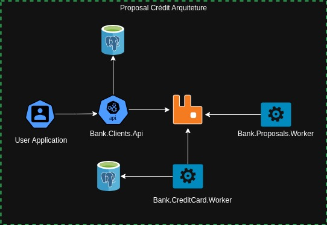

# Bank


Projeto desenvolvido para cadastro de clientes, propostas de crédito e geração de cartão de crédito.

## Índice

- [Visão Geral](#visão-geral)
- [Tecnologias utilizadas](#tecnologias-utilizadas)
- [Arquitetura](#arquitetura)
- [Instalação](#instalação)
    - [Pré Requisitos](#pré-requisitos)
    - [Comandos](#comandos)
- [Configuração](#configuração)
- [Testes](#testes)
- [Cenários Testes Aplicação](#cenários-testes-aplicação)
- [Contato](#contato)

## Visão Geral

Este projeto é composto por três microserviços principais:

1. **Cadastro de Clientes**: Gerencia as informações dos clientes.
2. **Proposta de Crédito**: Gerencia a criação e análise de propostas de crédito.
3. **Cartão de Crédito**: Gerencia a emissão e administração de cartões de crédito.

Dois Projetos para facilitar a implementação nos demais projetos:

1. **Core**: Centraliza Messagens de integração e configurações compartilhadas entre demais microserviços.
2. **Message**: Projeto responsável pela centralização da configuração do serviço de mensageria, neste exemplo o RabbitMq.
3. **Tests**: Projeto onde estão os testes unitários dos microserviços.

### Tecnologias utilizadas

- .NET 8.0
    - ASP.NET WebApi
    - Entity Framework Core 8
    - ASP.NET WebApi
    - XUnit - Testes Unitários

- Componentes/Serviços
    - RabbitMQ
    - Masstransit
    - FluentValidator
    - MediatR
    - Swagger UI
    - PostgresSql
    - Docker

## Arquitetura

A arquitetura do sistema é baseada em microserviços, cada um responsável por uma funcionalidade específica. A comunicação entre os microserviços é feita através de um serviço de mensageria para garantir escalabilidade e desacoplamento.

- **Cadastro de Clientes**
- **Proposta de Crédito**
- **Cartão de Crédito**




## Instalação

Instruções passo a passo sobre como configurar o ambiente de desenvolvimento.

### Pré Requisitos
- .Net 8.0 SDK
- Docker e Docker Compose

### Comandos

```bash
# Clone o repositório
git clone https://github.com/Micheler720/bank.git

# Execute o comado abaixo para criação da infra(banco de dados e rabbit)
docker compose up -d

# Navegue até o diretório do microserviço de cliente
cd src/services/Bank.Clients.Api

# Execute a aplicação
dotnet run --urls=https://127.0.0.1:5100

# Navegue até o diretório do microserviço do cartão de crédito
cd src/services/Bank.CreditCard.Worker

# Execute a aplicação
dotnet run --urls=https://127.0.0.1:5200

# Navegue até o diretório do microserviço proposta de crédito
cd src/services/Bank.Proposals.Worker

# Execute a aplicação
dotnet run --urls=https://127.0.0.1:5300 

#Microservico Cliente iniciará na porta 5100 e tem a UI do Swagger disponível.
#Microservico Proposal iniciará na porta 5300.
#Microservico CreditCard iniciará na porta 5200.
```
## Testes
Para executar os testes unitários basta executar os comandos abaixo:

```bash

# Navegue até o diretório do projeto de teste
cd src/tests/Bank.tests

# Execute a aplicação
dotnet test
```

## Cenários testes Aplicação

Cenários para testes de comportamento da aplicação:

- **Reprovação Propostas de Crédito:** documentos de iniciados com 11 sempre retornarão resultado reprovado na proposta de crédito.
- **Reprovação Cartão Crédito:** documentos de iniciados com 12 sempre retornarão resultado reprovado na criação do cartão do crédito.
- **Falha no processamento de Propostas de créditos:** documentos de iniciados com 22 sempre retornarão falha no consumo de uma score, cenário de reprocessamento 5 vezes.

** Demais documentos retornarão resultados aprovados. 

## Contato

[](https://www.linkedin.com/in/michele-ribeiro-9111a9a7/) 
[](mailto:micheler720@gmail.com)

